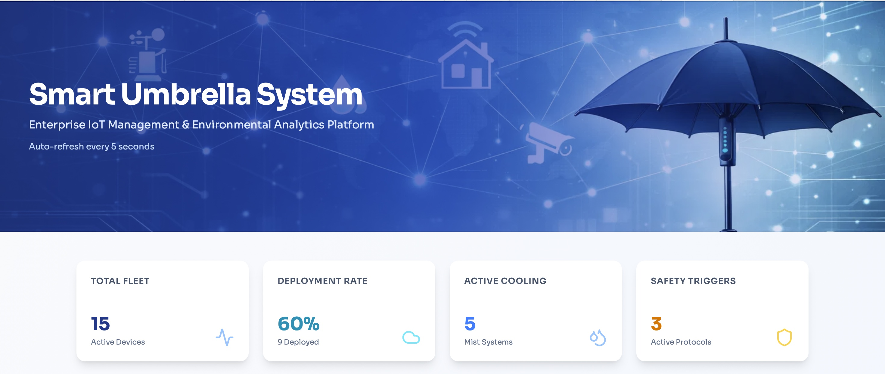
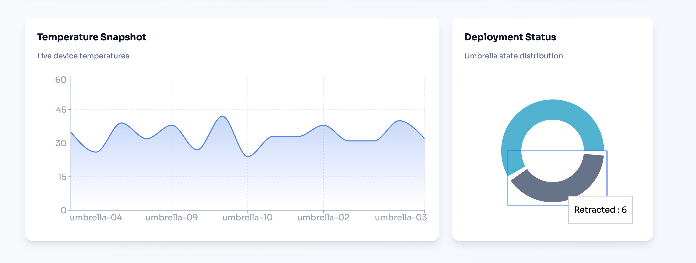
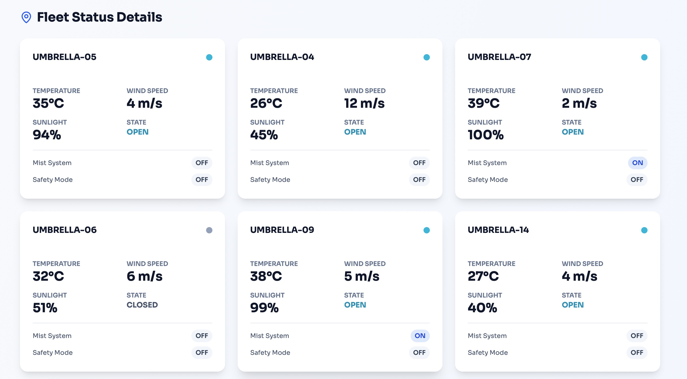
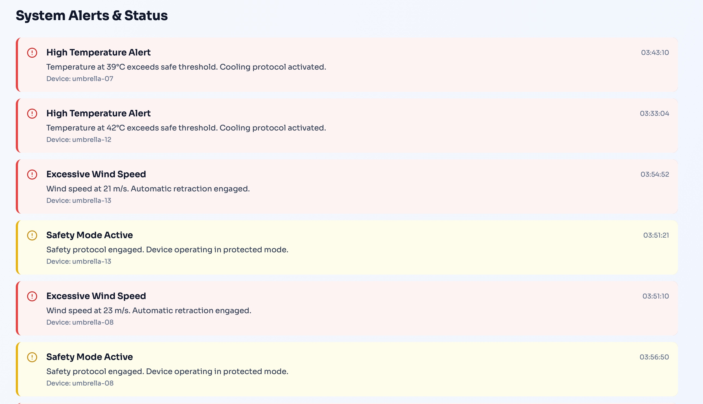

# Smart Umbrella Dashboard  
### Research-Driven IoT Digital Twin for Adaptive Outdoor Shading

<p align="left">
  <b>Author:</b> Hadeel Almutairi<br/>
  <b>Project Type:</b> Research-Based IoT Dashboard & Digital Twin Prototype<br/>
  <b>Role:</b> Solo Developer<br/>
  <b>Focus Areas:</b> IoT, Cloud Integration, Real-Time Monitoring, Smart City Applications
</p>

---

## Table of Contents
- [Overview](#overview)
- [Problem Statement](#problem-statement)
- [Project Goal](#project-goal)
- [What I Built](#what-i-built)
- [Why This Project Matters](#why-this-project-matters)
- [Digital Twin Concept](#digital-twin-concept)
- [System Architecture](#system-architecture)
- [Architecture Layers](#architecture-layers)
- [Smart Umbrella Logic](#smart-umbrella-logic)
- [Simulated Deployment Zones](#simulated-deployment-zones)
- [Tech Stack](#tech-stack)
- [Current Dashboard Features](#current-dashboard-features)
- [Sample Data Fields](#sample-data-fields)
- [Dashboard Preview](#dashboard-preview)
- [How to Run the Project](#how-to-run-the-project)
- [What This Project Demonstrates](#what-this-project-demonstrates)
- [Future Work](#future-work)
- [Current Limitations](#current-limitations)
- [Solo Contribution](#solo-contribution)
- [Author](#author)
- [Project Status](#project-status)

---

## Overview
**Smart Umbrella Dashboard** is a research-driven IoT monitoring platform built to simulate, monitor, and analyze a network of intelligent outdoor umbrellas designed for pedestrian comfort and safety in hot urban environments.

The project is based on the idea that outdoor walkways in hot climates often become uncomfortable and underused because of:

- intense solar exposure  
- rising ambient temperatures  
- lack of adaptive shade  
- limited weather-aware infrastructure  

To address this, I developed a **digital twin prototype** of a smart umbrella network that simulates multiple umbrella nodes under different environmental conditions and streams their data through a cloud-connected architecture. The system monitors each umbrella’s environmental state, operational mode, and safety response in real time through a professional web dashboard.

This project combines:

- **IoT simulation**
- **AWS IoT Core**
- **DynamoDB**
- **Node.js + tRPC**
- **React + TypeScript**
- **real-time dashboard visualization**

---

## Problem Statement
Traditional outdoor shading solutions are static. They do not adapt to:

- changes in sunlight direction  
- high temperatures  
- sudden rain  
- dangerous wind speed  

As a result, pedestrian spaces in hot cities can become thermally uncomfortable and less usable during large portions of the day.

The goal of this project is to explore how an **adaptive smart shading system** can improve pedestrian comfort and safety by using environmental sensing, automated control logic, cloud connectivity, and centralized monitoring.

---

## Project Goal
The goal of this project is to build and demonstrate a **cloud-connected digital twin** of an adaptive smart umbrella system that can:

- simulate multiple smart umbrella nodes  
- react to different environmental conditions  
- stream live telemetry to the cloud  
- store device data in DynamoDB  
- visualize the system through a professional monitoring dashboard  

This project focuses on validating the **data pipeline, control logic, and dashboard monitoring workflow** before moving toward full physical hardware deployment.

---

## What I Built
This repository represents the **software implementation and digital twin layer** of the Smart Umbrella concept.

I designed and implemented:

- a **Python-based umbrella simulator**
- multiple **virtual umbrella nodes** with different zone assignments
- multiple **environmental behavior profiles** such as:
  - normal
  - hot
  - windy
  - rainy
  - sunny
- live data publishing to **AWS IoT Core** using MQTT
- telemetry storage in **AWS DynamoDB**
- a **Node.js backend** to fetch and process live device data
- a **React dashboard** to monitor the fleet in real time
- alert generation for high heat, high wind, and safety mode events

This allows the system to behave like a real IoT infrastructure prototype even though the current implementation is simulation-based rather than fully hardware-deployed.

---

## Why This Project Matters
This project is valuable because it sits at the intersection of:

- **IoT systems**
- **cloud integration**
- **smart city applications**
- **environmental monitoring**
- **real-time dashboards**
- **research-to-prototype implementation**

It demonstrates how a real-world urban comfort problem can be translated into a technically meaningful system using cloud services, simulated devices, and an operational dashboard.

It also shows practical skills that are highly relevant for roles involving:

- IoT systems  
- cloud-connected devices  
- dashboards and analytics  
- backend/frontend integration  
- AWS services  
- smart infrastructure solutions  

---

## Digital Twin Concept
This project currently implements a **digital twin prototype** of the proposed smart umbrella system.

Instead of deploying a full physical umbrella fleet, I simulated a network of umbrella nodes distributed across different virtual pedestrian zones. Each umbrella was assigned a distinct environmental profile and operational behavior, allowing the system to model realistic scenarios such as:

- high temperature conditions  
- strong wind conditions  
- rainfall response  
- high sunlight exposure  

This digital twin approach made it possible to validate:

- the real-time telemetry pipeline  
- decision-making logic  
- AWS cloud integration  
- backend processing  
- dashboard visualization  

before moving to a full physical deployment stage.

---

## System Architecture

```text
Python Simulator
   ↓
AWS IoT Core (MQTT)
   ↓
AWS IoT Rule
   ↓
DynamoDB
   ↓
Node.js + tRPC Backend
   ↓
React Dashboard
```

### Architecture Layers

1.  **Device Layer**

The system starts with a Python-based simulator that represents multiple smart umbrellas as virtual IoT nodes.

Each umbrella generates live telemetry such as:
    *   temperature
    *   wind speed
    *   sunlight
    *   rain
    *   umbrella state
    *   mist status
    *   safety mode
    *   decision reason

2.  **Cloud Messaging Layer**

The simulator publishes telemetry to AWS IoT Core using MQTT.

3.  **Storage Layer**

AWS IoT rules route incoming messages into DynamoDB, where umbrella telemetry is stored and updated.

4.  **Backend Layer**

A Node.js + TypeScript + tRPC backend reads device data from DynamoDB and serves it to the frontend.

5.  **Frontend Layer**

A React dashboard visualizes the umbrella network, environmental status, and system alerts in real time.

---

## Smart Umbrella Logic

Each umbrella follows environmental decision rules to simulate intelligent outdoor shading behavior.

### Example System Logic
    *   If wind speed is high
        → umbrella closes and activates Safety Mode
    *   If rain is detected
        → umbrella opens for pedestrian protection
    *   If sunlight is high
        → umbrella opens and adjusts shade behavior
    *   If temperature is high
        → mist cooling activates
    *   If no exceptional condition exists
        → umbrella remains in normal mode

This logic makes the dashboard meaningful because it reflects behavioral system decisions, not just random sensor values.

---

## Simulated Deployment Zones

To make the prototype more realistic, umbrellas were assigned to virtual pedestrian zones such as:
    *   North Gate Walkway
    *   Student Plaza
    *   Main Pedestrian Path
    *   South Entrance
    *   Library Walkway
    *   Campus Courtyard
    *   Bus Stop Area
    *   Parking Walkway
    *   Central Plaza
    *   West Gate
    *   East Gate
    *   Science Plaza
    *   Engineering Walk
    *   Medical Center Path
    *   Innovation Hub

This allowed the project to simulate a distributed smart umbrella network rather than a single isolated device.

---

## Tech Stack

### Frontend
    *   React
    *   TypeScript
    *   Tailwind CSS
    *   shadcn/ui
    *   Recharts
    *   Lucide React
    *   Wouter

### Backend
    *   Node.js
    *   TypeScript
    *   tRPC
    *   Express-based server core
    *   AWS SDK

### Cloud
    *   AWS IoT Core
    *   DynamoDB

### Simulation
    *   Python
    *   AWSIoTPythonSDK

---

## Current Dashboard Features

### KPI Cards

The dashboard provides top-level monitoring metrics such as:
    *   Total Fleet
    *   Deployment Rate
    *   Active Cooling
    *   Safety Triggers

### Environmental Visualization

The dashboard includes visual components such as:
    *   temperature snapshot
    *   deployment status visualization
    *   fleet-level environmental distribution

### Fleet Status Monitoring

Each umbrella card displays:
    *   device ID
    *   temperature
    *   wind speed
    *   sunlight
    *   umbrella state
    *   mist status
    *   safety mode

### Alerts

The system generates alerts for:
    *   high temperature
    *   excessive wind speed
    *   safety mode activation
    *   general system status

### Real-Time Refresh

The dashboard is configured to auto-refresh periodically and reflect updates from the live DynamoDB-backed data source.

---

## Sample Data Fields

Each umbrella record is modeled using fields such as:

```json
{
  "deviceId": "umbrella-07",
  "temperature": 39,
  "windSpeed": 2,
  "sunlight": 100,
  "umbrellaState": "OPEN",
  "mistStatus": "ON",
  "safetyMode": "OFF",
  "timestamp": "2026-03-15T..."
}
```

Additional contextual fields such as:
    *   zone
    *   mode
    *   decisionReason
    *   shadeAngle

can also be included in the telemetry.

---

## Dashboard Preview

<table>
  <tr>
    <td align="center" width="50%">
      <br/>
      <b>1. Main Dashboard Overview</b><br/>
      This screen presents the main dashboard header and top-level KPI cards, including total fleet size, deployment rate, active cooling systems, and safety triggers.
    </td>
    <td align="center" width="50%">
      <br/>
      <b>2. Live Environmental Analytics</b><br/>
      This view shows temperature trends and umbrella deployment distribution to support real-time environmental monitoring and fleet-level analysis.
    </td>
  </tr>
  <tr>
    <td align="center" width="50%">
      <br/>
      <b>3. Fleet Status Monitoring</b><br/>
      This section displays detailed status cards for individual umbrella nodes, including temperature, wind speed, sunlight, umbrella state, mist system status, and safety mode.
    </td>
    <td align="center" width="50%">
      <br/>
      <b>4. Alert and Safety Monitoring</b><br/>
      This section highlights active system alerts such as high temperature warnings, excessive wind speed, and safety mode activation.
    </td>
  </tr>
</table>

---

## How to Run the Project

1.  **Start the Dashboard**

    ```bash
    cd ~/Downloads/smart-umbrella-dashboard
    pnpm install
    pnpm dev
    ```

2.  **Required .env**

    Create a `.env` file in the project root:

    ```
    PORT=4000
    AWS_REGION=eu-north-1
    DYNAMODB_TABLE=UmbrellaDebug
    AWS_ACCESS_KEY_ID=YOUR_KEY
    AWS_SECRET_ACCESS_KEY=YOUR_SECRET
    OAUTH_SERVER_URL=http://localhost:4000
    VITE_ANALYTICS_ENDPOINT=analytics
    VITE_ANALYTICS_WEBSITE_ID=local-dev
    ```

3.  **Open the Dashboard**

    `http://localhost:4000`

4.  **Start the Simulator**

    ```bash
    cd ~/Desktop/smart-shading-aws
    source .venv/bin/activate
    python simulator/umbrella_simulator.py
    ```

5.  **Recommended Simulator Refresh**

    Use a controlled publishing interval such as:

    `time.sleep(10)`

    to avoid flooding the cloud pipeline while still maintaining near real-time updates.

---

## What This Project Demonstrates

This project demonstrates practical ability in:
    *   building research-backed technical prototypes
    *   designing IoT data pipelines
    *   integrating AWS cloud services
    *   working with DynamoDB
    *   building full-stack dashboards
    *   handling near-real-time monitoring workflows
    *   connecting backend and frontend systems
    *   designing scalable smart infrastructure concepts

---

## Future Work

This prototype is designed to be practically extensible.

Future improvements may include:

### Hardware Deployment
    *   real ESP32-based umbrella nodes
    *   real environmental sensors
    *   real motor actuation
    *   physical mist cooling subsystem
    *   solar-powered field prototype

### Fog Layer Integration
    *   Raspberry Pi local gateway
    *   local buffering and synchronization
    *   offline-first edge-to-cloud behavior

### Dashboard Enhancements
    *   deployment map view
    *   historical analytics
    *   per-zone filtering
    *   device search and drill-down
    *   maintenance logs
    *   operator control panel

### Intelligence & Automation
    *   weather API integration
    *   predictive maintenance
    *   anomaly detection
    *   smarter control optimization
    *   comfort analytics by zone

### Product Readiness
    *   user authentication refinement
    *   role-based admin access
    *   deployment reporting
    *   production-ready hosting
    *   mobile-responsive monitoring improvements

---

## Current Limitations

This project currently represents a digital twin prototype, not a full physical deployment.

Current limitations include:
    *   simulated rather than real hardware telemetry
    *   no physical actuation layer yet
    *   no live edge/fog hardware gateway deployed
    *   limited historical analytics
    *   dashboard currently focused on monitoring rather than command/control

These limitations are intentional for this stage and make the system a strong validation platform before physical deployment.

---

## Solo Contribution

This project was independently developed by Hadeel Almutairi as a research-driven smart umbrella dashboard and digital twin prototype.

My contribution included:
    *   concept translation from research into implementation
    *   simulator logic design
    *   AWS IoT and DynamoDB integration
    *   backend data flow implementation
    *   dashboard debugging and live data validation
    *   frontend monitoring interface customization
    *   overall system integration and testing

---

## Author

Hadeel Almutairi
Information Technology Student
Network Engineering & Internet of Things Track
King Saud University

---

## Project Status
    *   Research concept defined
    *   Digital twin implemented
    *   Multi-device telemetry simulation completed
    *   AWS IoT Core integration completed
    *   DynamoDB live storage completed
    *   Dashboard connected to real backend data
    *   Prototype ready for further extension toward hardware deployment
